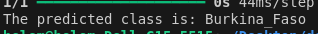

# flags-recognition-ai-model
AI model to recognize any flag from the trained dataset.
### In progress ...
***For fun 😃 but what if we take it serious 😎? I guess it worth it, isn't it?***

## Sample of test 

### Key features I would like to add 

* Use Arg parse to allow the runner use what task to perform
* Add more data to improve accuracy
* Add Desktop GUI with PyQt TO make it user friendly